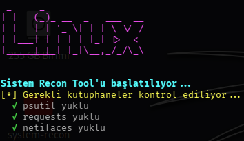

<p align="center">
  
</p>

<h1 align="center">🛰️ System Recon Tool</h1>

<p align="center">
  Advanced System & Network Reconnaissance Tool written in Python
</p>

<p align="center">
  
  
  
</p>

---

## 🚀 Features

✔ System information gathering  
✔ Network interface analysis  
✔ Open port scanning  
✔ Local network discovery  
✔ Running process inspection  
✔ Hardware statistics  
✔ JSON report export  

---

## 📸 Screenshots

### System Information


### Network & Port Scan


### Summary Report


---

## 🛠 Installation

```bash
git clone https://github.com/SideX-Web/system-recon
pip install -r requirements.txt
cd src
python3 system_recon.py
